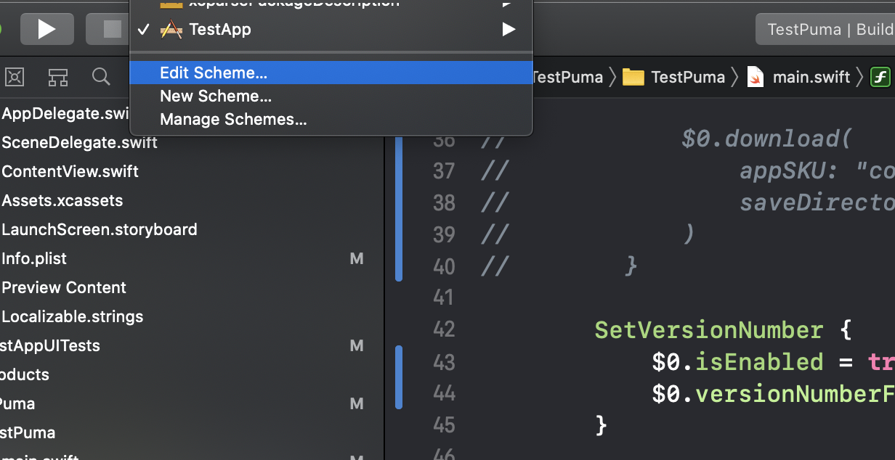
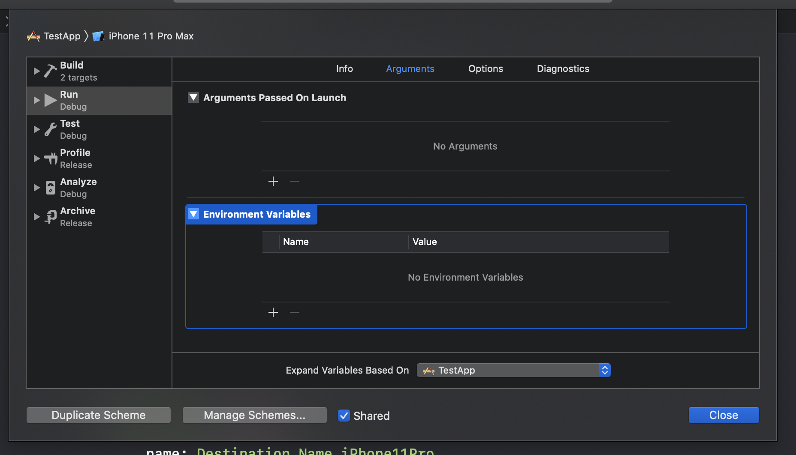

## Developing Puma

To develop Puma, head over to [TestPuma](https://github.com/pumaswift/Puma/tree/develop/Example/TestPuma), there is a TestPuma Command Line Tool macOS project with a `main.swift`.

In Example folder, there is a worksapce TestPuma, it contains

- TestPuma project: this is a macOS command line project to create executable
- Puma project
- TestApp: the test iOS app

### Generate Puma project

Since Swift Package Manager contains only sources, in order to work with Xcode, run the following command to generate Puma project

```sh
swift package generate-xcodeproj
```

### Run TestPuma

Open `Example/TestPuma.xcworkspace`, the Puma project has already been included. Select TestPuma scheme, in order to run

- You need to sign TestPuma target, the easiest way is to check Automatic Signing and select a team
- You need to sign all frameworks in Puma project.


### Play around

You need to tweak the `teamId` and options according to your project.

```swift
import Foundation
import Puma
import PumaCore
import PumaiOS

func testDrive() {
    Workflow {
        PrintWorkingDirectory()

        Wait(seconds: 2)

        Retry(times: 2) {
            PrintWorkingDirectory()
        }

        RunScript("echo 'Hello Puma'")
            .name("Hello Puma")

        DownloadMetadata(appSKU: "com.onmyway133.KeyFighter", saveDirectory: Directory.downloads.path)
            .username(ProcessInfo().environment["username"]!)
            .password(ProcessInfo().environment["password"]!)

        SetVersionNumber("1.1")
            .enable(false)

        ShowAvailableDestinations()

        SetBuildNumber("3")

        BootSimulator(Destination(name: "iPhone 8 Plus", platform: .iOS, os: "13.2"))
            .enable(false)

        Build(forTesting: true)
            .project("TestApp")
            .scheme("TestApp")

        Test(withoutBuilding: true)
            .project("TestApp")
            .scheme("TestApp")
            .destination(Destination(name: Destination.Name.iPhone11, platform: .iOSSimulator, os: Destination.OS.iOS13_2_2))

        Screenshot()
            .enable(false)
            .project("TestApp")
            .appScheme("TestApp")
            .uiTestScheme("TestAppUITests")
            .saveDirectory(Directory.downloads.appendingPathComponent("PumaScreenshots").path)
            .scenarios(
                .init(
                    destination: .init(
                        name: Destination.Name.iPhone11,
                        platform: .iOSSimulator,
                        os: Destination.OS.iOS13_2_2
                    ),
                    language: Language.en_US,
                    locale: Locale.en_US
                ),
                .init(
                    destination: .init(
                        name: Destination.Name.iPhone11Pro,
                        platform: .iOSSimulator,
                        os: Destination.OS.iOS13_2_2
                    ),
                    language: Language.ja,
                    locale: Locale.ja
                )
            )

        Archive()
            .enable(false)
            .projectType(.project("TestApp"), archivePath: Directory.downloads.appendingPathComponent("TestApp.xcarchive").path)
            .scheme("TestApp")

        let exportOptions = ExportArchive.ExportOptions(
            method: ExportArchive.ExportMethod.development,
            signing: .automatic(.init(teamId: ProcessInfo().environment["teamId"]!))
        )
        ExportArchive(options: .options(exportOptions))
            .enable(false)
            .projectType(.project("TestApp"), archivePath: Directory.downloads.appendingPathComponent("TestApp.xcarchive").path)
            .exportPath(Directory.downloads.path)

        UploadApp(ipaPath: Directory.downloads.appendingPathComponent("TestApp.ipa").path)
            .enable(false)
            .username(ProcessInfo().environment["username"]!)
            .password(ProcessInfo().environment["password"]!)

        Slack {
            Slack.Message(
                token: ProcessInfo().environment["slackBotToken"]!,
                channel: "random",
                text: "Hello from Puma",
                username: "onmyway133"
            )
        }
    }
        .workingDirectory(Directory.home.appendingPathComponent("XcodeProject2/Puma/Example/TestApp").path)
        .logger(FileLogger(saveFilePath: Directory.downloads.appendingPathComponent("puma.log").path))
        .run()
}

testDrive()
```

## Environment variables and secrets

In the TestPuma workspace, there's TestPuma scheme which is configured on the TestPuma macOS command line target. It is shared which means it gets tracked inside git history. If you run Puma inside Xcode, consider duplicating that TestPuma scheme to another unshared scheme, so you can configure launch arguments and environment variables there.



Pass your environment variables here:


