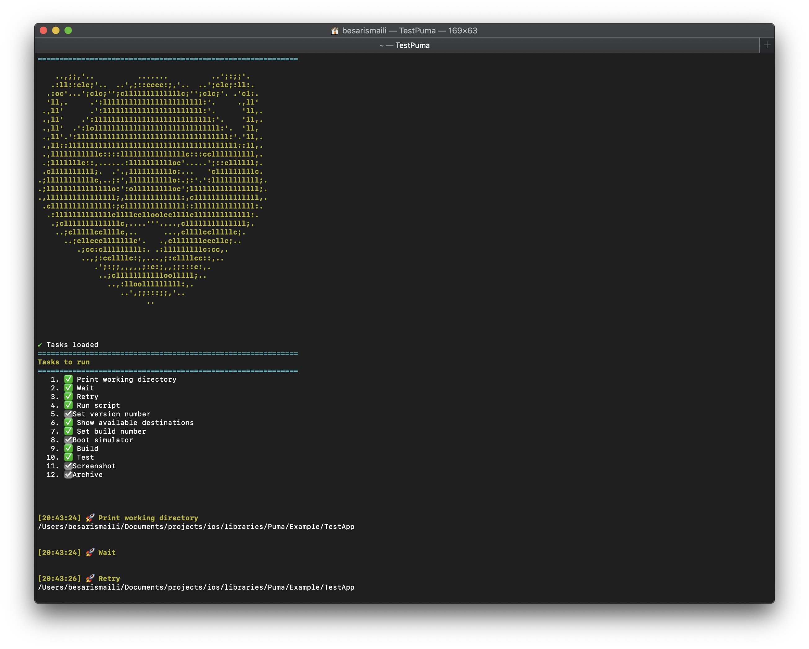

# Puma

<div align="center">
    
</div>

Puma is a set of build utilities to automate mobile application development and deployment.

Unlike other command line tool that you need to understand lots of command line arguments, Puma is intended to be used as a Swift library. Just import in your Swift script file and run. There's no additional configuration file, your Swift script file is the source of truth. With auto completion and type safety, you are ensured to do the right things in Puma.

- Puma and its dependencies are written in pure Swift, making it easy to read and contribute.
- Use latest Swift 5.1 features like function builder to enable declarative syntax
- Type-safe. All required and optional arguments are clear.
- No configuration file. Your Swift script is your definition.
- Simple wrapper around existing tools like xcodebuild, instruments and agvtool
- Reuse awesome Swift scripting dependencies from Swift community



To see Puma in action, see this [gif](Screenshots/puma.gif)

Below is an example script where it performs the following tasks and finally it posts to slack, for more detailed information check the documentation

```swift
import Foundation
import Puma
import PumaCore
import PumaiOS

let workflow = Workflow {
    RunScript {
        $0.script = "echo 'Hello Puma'"
    }

    Screenshot {
        $0.configure(
            projectType: .project("TestApp"),
            appScheme: "TestApp",
            uiTestScheme: "TestAppUITests",
            saveDirectory: Directory.downloads.appendingPathComponent("PumaScreenshots").path
        )

        $0.add(scenarios: [
            .init(
                destination: .init(
                    name: Destination.Name.iPhone11,
                    platform: Destination.Platform.iOSSimulator,
                    os: Destination.OS.iOS13_2_2
                ),
                language: Language.en_US,
                locale: Locale.en_US
            ),
            .init(
                destination: .init(
                    name: Destination.Name.iPhone11Pro,
                    platform: Destination.Platform.iOSSimulator,
                    os: Destination.OS.iOS13_2_2
                ),
                language: Language.ja,
                locale: Locale.ja
            )
        ])
    }

    ShowUsers {
            $0.authenticate(
                issuerID: ProcessInfo().environment["issuerID"]!,
                privateKeyID: ProcessInfo().environment["privateKeyID"]!,
                privateKey: ProcessInfo().environment["privateKey"]!
            )
    }

    ExportArchive {
        $0.isEnabled = false
        $0.configure(
            projectType: .project("TestApp"),
            archivePath: Directory.downloads.appendingPathComponent("TestApp.xcarchive").path,
            optionsPlist: .options(
                .init(
                    method: ExportArchive.ExportMethod.development,
                    signing: .automatic(
                        .init(teamId: ProcessInfo().environment["teamId"]!)
                    )
                )
            ),
            exportDirectory: Directory.downloads.path
        )
    }

    Slack {
        $0.post(
            message: .init(
                token: ProcessInfo().environment["slackBotToken"]!,
                channel: "random",
                text: "Hello from Puma",
                username: "onmyway133"
            )
        )
    }
}

workflow.workingDirectory = Directory.home.appendingPathComponent("XcodeProject/TestApp").path
workflow.run()
```

## Documentation

- [Getting Started](Documentation/GettingStarted.md)
- [Workflow](Documentation/Workflow.md)
- [Tasks](Documentation/Tasks.md)
- [Tips and tricks](Documentation/Tips.md)
- [Develop](Documentation/Develop.md)
- [Compile Puma from source](Documentation/Compile.md)
- [Dependencies](Documentation/Dependencies.md)
- [In the press](Documentation/InThePress.md)
- [FAQ](Documentation/FAQ.md)


## Contributing

Puma is in its early development, we need your help.

## License
Puma is released under the MIT license. See [LICENSE](LICENSE) for details.
